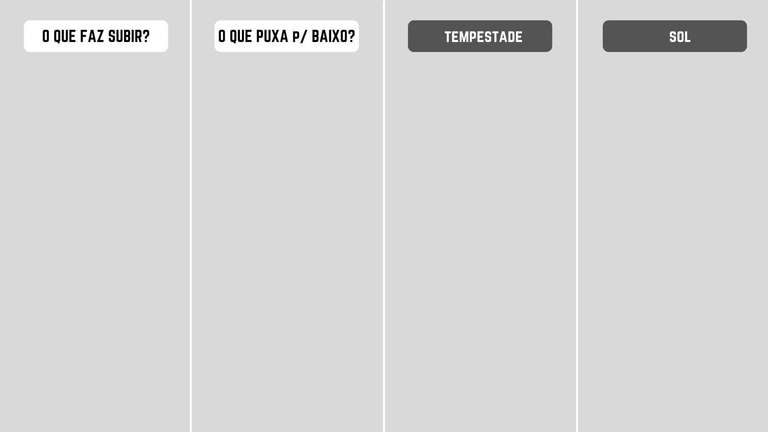

### **Objetivo da Retrospectiva:**

- Identificar o que funcionou e o que pode ser melhorado.
- Abordagem técnica e aspectos relacionados ao trabalho em equipe.

### **Hot Air Balloon:**

#### - Descrição Visual:
Balão de ar quente dividido em duas partes:

        • Parte superior: Forças que impulsionam para cima.
        • Parte inferior: Forças que puxam para baixo.
        • Lados: As forças futuras

---

Ajuda a equipe a identificar coisas que fazem elas se mover rapidamente e coisas que fazem se mover devagar. É baseada em dois pontos focais: força e ar quente e forças que puxam para baixo.

---

## **Descrição das Partes**

#### **Na parte superior do balão**
O Fogo e ar quente é o que ajuda o balão a subir, olhando pro nosso time, o que nos ajuda a subir? Quais são as coisas que nos impulsionam?

#### **Na parde inferior do balão**

Ao mesmo tempo, temos os sacos de areia na cesta dos viajantes do balão nos que puxa pra baixo, são as forças que puxam para baixo, por isso quais são as forças que nos puxam "como time" para baixo?

#### **Tempestade**

O que é a tempestade à nossa frente? O que tornará nossa viagem turbulenta?

#### **Sol**

O que poderíamos fazer para evitar a tempestade e voltar para os dias de sol? O que devemos fazer para superar os possíveis desafios que temos pela frente? Essa atividade funciona bem para equipes remotas.

